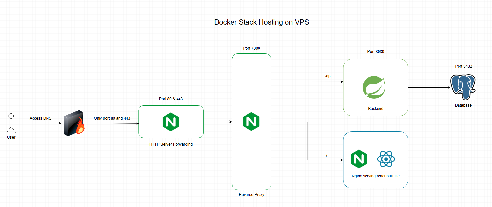

# wk-ntu-fyp

## Features
This project aims to promote lifelong learning and serves as a Final Year Project. It provides users with personalized career recommendations by parsing their resumes and guiding them through a questionnaire.

### Key features
1. Career Recommendations:
Users receive a curated list of career paths based on their current experience and skills extracted from their resume and questionnaire responses.

2. Career Exploration:
On the Explore Career page, users can view potential careers they could pivot to. This is based on a comparison between their existing skill set and the skills required for various careers.

3. Skill Gap Analysis & Learning Path:
Users can prefer a career from either the results or exploration page. Once a career is selected, the system generates:

4. A list of skills to develop
A personalized learning path with recommended courses

5. Learning Timeline:
Users can follow a structured timeline to acquire the recommended skills by completing suggested courses.

6. Progress Dashboard:
A dedicated dashboard allows users to track their progress toward their desired career and identify skill gaps they need to close.

## Software required
1. Any Java ide, maven(mvn) and java installed 

2. NPM

3. Docker

4. Python (for first time start up)

## Project Structure

Here's a breakdown of the main folders in the repository:
1.  ```/frontend``` – Contains the React + Vite frontend source code.

2.  ```/backend``` – The Spring Boot backend application.

3.  ```/scripts``` – Utility scripts for scraping data from sources like the Coursera catalog and SkillsFramework CSV.

4. The ```/scripts/coursera``` folder holds the raw data used to power the application.

5. The ```main.py``` script is used to parse and insert this data into the database.

6.  ```/docs``` – Project documentation, diagrams, and related resources.

7.  ```/reverse-proxy``` – Example Nginx reverse proxy configuration files for deployment setup.

## Envrionment Variables Setup

### Set these in your .env file at the project root:
```
PG_USERNAME = 
PG_PASSWORD = 
PG_DATABASE = 
PG_URL = 
SERVER_NAME= "www.localhost localhost"
SHOW_SQL=
VITE_BACKEND_URL = "http://localhost:7000/api"
```

### Frontend (.env for Vite)
**The backend will be on port 5432 locally**
```
VITE_BACKEND_URL = "http://localhost:7000/api"
```
### Backend (For local development in IDE)
**The backend will be on port 8080 locally**
```
PG_USERNAME = 
PG_PASSWORD = 
PG_DATABASE = 
PG_URL = 
VITE_BACKEND_URL = 
SHOW_SQL = 
```

## First time start for initial data
1. Ensure docker is installed and turned on

2. At root folder, create .env file and run ```docker-compose up postgres-db```

3. cd script folder and run ```python main.py```. This will insert the datas into the database. Ensure that you have installed the dependencies before you run it

## Instruction for developing the application
1. As the repo is using husky to run some pre-commit checks. Run ```npm install``` on the root folder and ensure mvn is installed in your terminal. The pre-commit checks will ensure the typescript's eslint is happy and the backend app is able to start

## How to run the apps locally

### Frontend
1. cd wgtpivotlo-frontend

2. ```npm install``

3. ```npm run dev```

4. The app will be on port 5173

### Backend
1. Use any java ide, preferrably Intellj

2. Point the project directory to wgtpivotlo-backend

3. Ensure that it has the .env file and the ide's envrionment is using .env file if not the app will not start up

4. Ensure that the database container is up and running by running ```docker-compose up postgres-db``` on the root folder

5. Access the backend by making api call to localhost:8080


## Running the Images with Docker

To run the services using local builds instead of prebuilt images, follow these steps:

1. **Switch from image to build for backend and frontend service if the images are not in any docker image registry**  
   Comment out the `image` line and uncomment the `build` line in your `docker-compose.yml`.  
   **Example:**
   ```yaml
   backend:
     # Image is stored in registry, uncomment this is you have upload docker image into any registry
     # image: ghcr.io/wk981/wk-fyp-backend:latest
     build: ./wgtpivotlo-backend

2. Set up environmental variables. Example: /.env

3. If you do not have maven command installed, please uncomment ```line 1 to line 18``` from ```wgtpivotlo-backend/Dockerfile``` and comment ```line 20 to line 22```

4. Start the container
   ``` docker-compose up```

5. Verify the containers are running by checking the docker desktop app or using ``` docker ps ``` command

6. Test the API using postman or curl and make a get request to localhost:7000/api/ping

7. Access the frontend by going to localhost:7000/ will serve the frontend static files. [See why it's port 7000 in Docker](#why-is-the-frontend-served-on-port-7000-in-docker)

## Uploading Docker images into any registry

1. Follow the registry instruction on how to build docker image and push the image to the registry. The current registry I am using is Github Image Registry and it is private. The images can only be accessed by my Personal Access Token.

2. As for building the images, backend image can vary from user's terminals. If you do not have maven command installed, please uncomment ```line 1 to line 18``` from ```wgtpivotlo-backend/Dockerfile``` and comment ```line 20 to line 22```. Frontend image do not need any external dependencies

## Why is the frontend served on port 7000 in Docker?
1. A reverse proxy is set up between HTTP webserver and the application where "/" will be routed to the frontend container while "/api" is routed to the backend


## Archieteture
1. **3 Tier web app**


2. **Deployment**



## Deployment

### The application is currently hosted on a Virtual Private Server

#### How to set the deployment up
1. Clone the repo to the server

2. Harden the VPS such as updating linux dependencies, enabling only SSH connection, set up firewalls to all ports except 80 and 443, disable root user and password login

3. Install nginx on the server and it will act as a HTTP web server. Copy the nginx.conf from the root folder and paste it in the server Nginx folder

4. Generate SSL certificate using certbots and copy the certs into the nginx folder

4. Ensure docker is installed on vps.If the docker images are not in any docker image registry, follow [Running the Images with Docker](#running-the-images-with-docker) and run ```docker-compose up```. If not, just run ```docker-compose up```

5. The application should be up and running along with HTTPS

## More stuff
1. API endpoint can be found [Here](./docs/apiDocs.md)